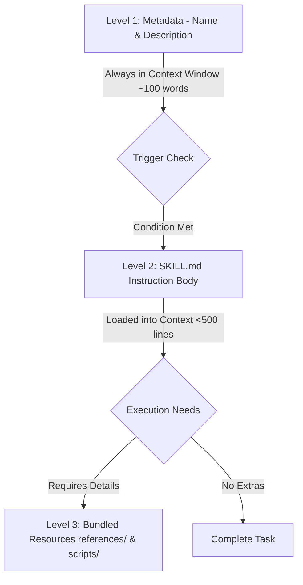

# 📜 Agent Skills Taxonomy & Standardization Spec

In the context of the **P2P Skills Economy** and our **[[Netnavi]] Dual-Memory Architecture**, a **Skill** represents a modular, executable capability that resides in the **Action Layer**. Unlike **[[cognitive-battle-chips]]** (which act as prompt-level, cognitive modifiers for reasoning), a Skill is task-oriented, reusable, and deterministic.

This specification documents the standardized structure, progressive loading model, and developer best practices for creating and deploying Agent Skills.

---

## 🏗️ Anatomy of a Skill

Every skill is packaged as a self-contained directory containing instructions, executable assets, and supporting reference documentation:

```text
skill-name/
├── SKILL.md (required)
│   ├── YAML frontmatter (name, description required)
│   └── Markdown instructions
└── Bundled Resources (optional)
    ├── scripts/    - Executable code for deterministic/repetitive tasks
    ├── references/ - Domain-specific docs loaded into context dynamically
    └── assets/     - Static files used in output (templates, icons, fonts)
```

### 1. `SKILL.md` (Core Specification)
The entrypoint of the skill. It MUST contain YAML frontmatter with the following keys:
*   `name`: Unique skill identifier (e.g., `skill-creator`, `vault.search`).
*   `description`: Persuasive description outlining *what* the skill does and *when* it must be triggered.
*   `compatibility` (optional): Required terminal tools, APIs, or dependencies.

### 2. Bundled Resources
*   **`scripts/`**: Executable scripts (Python, Bash, JS) that run on the host system to carry out deterministic procedures. The agent can invoke these scripts without needing to load their source code into the active LLM context.
*   **`references/`**: Heavy documentation files (e.g., API schemas, library specifications) that are structured hierarchically and loaded into the prompt context *only when needed* (e.g., dynamically reading `references/aws.md` instead of `references/gcp.md` depending on the cloud deployment target).
*   **`assets/`**: Read-only assets like templates, configuration templates, or design files that the skill modifies or copies to target paths.

---

## 🔄 Three-Level Progressive Disclosure (Context Budgeting)

To minimize token footprint, prevent context pollution, and save memory, skills use a three-level loading protocol:



1.  **Level 1: Metadata (Always In Context - ~100 words)**
    *   Consists of the skill `name` and `description` from the YAML frontmatter.
    *   Used by the Routing Engine to evaluate if the skill is relevant to the active prompt.
2.  **Level 2: Instruction Body (Loaded on Trigger - <500 lines ideal)**
    *   The markdown instructions contained in `SKILL.md`.
    *   Loaded into the context window *only* when the Routing Engine activates the skill.
    *   Must be kept compact. If instructions exceed 500 lines, they should be broken down into sub-files in the `references/` directory.
3.  **Level 3: Bundled Resources (Loaded as Needed - Variable size)**
    *   Large specification sheets, reference templates, and scripts.
    *   Never loaded automatically; the instructions in `SKILL.md` guide the agent to read specific files only when relevant.

---

## 🚀 The "Pushy" Trigger Description Rule

LLMs and agents tend to **undertrigger** skills—meaning they fallback to default conversational reasoning instead of using specialized skill workflows. To combat this:

> [!IMPORTANT] The Pushy Rule
> The YAML `description` MUST be written persuasively ("pushy") and explicitly dictate all phrases, scenarios, and contexts under which the skill should be triggered, including implicit user intents.
> 
> *   **Weak Description:** `Creates a simple fast dashboard to display database metrics.`
> *   **Pushy (Correct) Description:** `Create a simple fast dashboard to display database metrics. Make sure to use this skill whenever the operator mentions dashboards, data visualization, internal metrics, database health, or wants to display any kind of metrics, even if they do not explicitly ask for a dashboard.`

---

## ✍️ Skill Writing Guidelines

When writing the Markdown instructions in `SKILL.md`:

1.  **Use the Imperative Mood:** Address the model directly (e.g., *"Spawn two subagents concurrently"* or *"Save timing metadata immediately"*).
2.  **Define Structured Outputs:** Use explicit templates for file outputs to avoid model variance:
    ```markdown
    ## Output Format
    ALWAYS use the following exact structure:
    # [Title]
    ## Executive Summary
    ## Implementation Steps
    ```
3.  **Provide Concrete Examples:** Use input/output pairing to demonstrate exact behavior:
    ```markdown
    **Example:**
    Input: Added authentication via OAuth
    Output: feat(auth): implement OAuth2 authentication pipeline
    ```
4.  **Explain the "Why":** Rather than using heavy-handed commands like `MUST`, use Theory of Mind to explain *why* a particular step or security boundary is critical. This improves compliance in zero-shot execution.
5.  **Principle of Lack of Surprise:** Skills must never contain obfuscated execution paths, malware, or undocumented side-effects. All commands executed by a skill must align with the user-facing intent.

---

## 🔗 Related
*   **[[000_CORE_SKILLS]]** — The central catalog of active skills in the Vault.
*   **[[cognitive-battle-chips]]** — Prompt-level execution modifiers (OODA, skeptic, l99).
*   **[[Netnavi]]** — The core NetNavi engine executing these skills.
*   **[[vault_search.skill]]** — Example implementation of a local skill.
